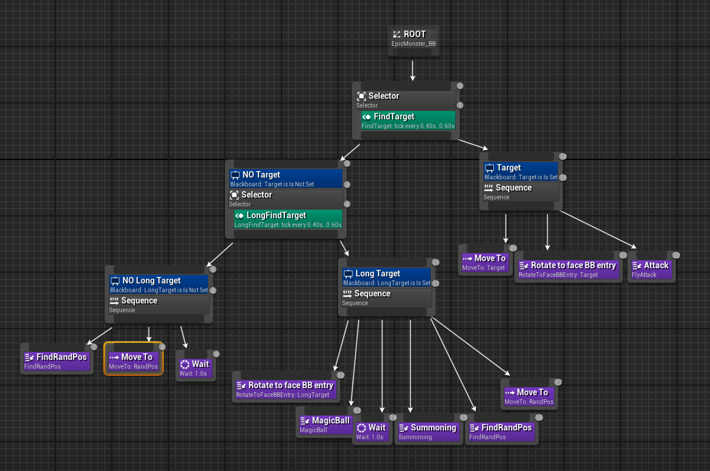
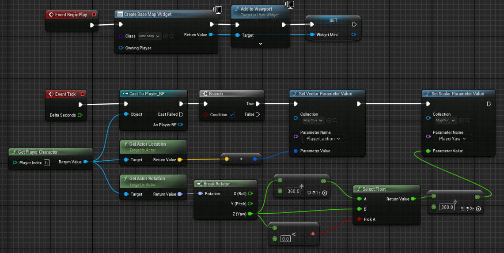

# Y2PK_Team_RPG

🔗 [유튜브 플레이 영상 보기](https://www.youtube.com/watch?v=NWj8hIFVd30)

## 📅 프로젝트 정보

- **기간**: 2024년 10월 17일 ~ 2024년 12월 11일 
- **인원**: 총 4명 (모두 프로그래머로 구성)

## 📌 프로젝트 개요

본 프로젝트는 **7주간 개발된 언리얼 엔진 기반 3D 던전 루프형 액션 RPG 게임**입니다.  
총 4인 팀이 참여하여 GitHub를 기반으로 협업과 버전 관리를 수행하였으며,  
모든 주요 시스템은 **C++과 언리얼 블루프린트**를 병행해 직접 구현하였습니다.

### 🎮 게임 구조

플레이어는 **마을에서 아이템을 구매하거나 장비를 정비한 후**,  
스테이지로 출전하여 몬스터와 전투를 벌이고,  
**전리품(골드, 아이템)을 챙겨 마을로 귀환**하는 루프를 반복합니다.  

게임은 총 **5개 지역(마을 → 스테이지1 → 보스1 → 스테이지2 → 보스2)** 으로 구성되어 있으며,  
각 지역은 고유한 몬스터 AI, 스킬 패턴, 전투 연출, UI를 포함합니다.

### ⚙️ 주요 구현 요소
- **AIController + Behavior Tree**를 활용한 몬스터 전투 로직
- **마을/NPC 상호작용 기반 상점 시스템**
- **스탯/장비/인벤토리 기반 전투 성장 구조**
- **다양한 위젯 기반 UI (체력바, 경험치, 상점, 스킬, 미니맵 등)**


### 🔍 클래스 구조도
 MyGameInstance (게임 단계 및 전역 데이터 관리)

- AActor  
  ├── AEffectManager (이펙트 관리)  
  ├── ASoundManager (사운드 관리)  
  ├── AUIManager (UI 전체 관리)  
  ├── AGameModeBase (게임 진행 관리)  
  │   ├── AStartGameModeBase (시작 화면 모드)  
  │   ├── AMyGameModeBase (기본 플레이 모드)  
  │   │   ├── AStage1NormalGameModeBase (스테이지 1 일반)  
  │   │   ├── AStage2NormalGameModeBase (스테이지 2 일반)  
  │   ├── ABossGameModeBase (보스전 모드)  
  │   │   ├── AStage1BossGameModeBase (스테이지 1 보스)  
  │   │   ├── AStage2BossGameModeBase (스테이지 2 보스)  
  ├── AMyCreature (ACharacter 상속)  
  │   ├── AMyPlayer (플레이어 캐릭터)  
  │   │   ├── ADragon (특수 조작 캐릭터)  
  │   ├── AMyMonster  
  │   │   ├── ANormalMonster  
  │   │   ├── EpicMonster_witch  
  │   │   ├── ABossMonster  
  │   │   ├── ABoss2Monster  
- AMyComponent  
  ├── UStatComponent (스탯 관리)  
  ├── UInventoryComponent (인벤토리 시스템)  
  ├── UShopComponent (상점 기능)  
- ABaseItem  
  ├── AEquipItem (장비 아이템)  
  │   ├── Helmet, ShoulderGuard, UpperArmor, LowerArmor  
  │   ├── Sword, Shield  
  ├── AConsumeItem (소비 아이템)  
  │   ├── Gold, HP_Potion  
- AnimationInstance  
  ├── BaseAnimInstance  
  ├── PlayerAnimInstance  
  ├── Monster_N / Boss01 / Boss2 / Epic01  
  ├── DragonAnimInstance  
- PlayerController  
  ├── MyPlayerController (UI 및 입력)  
  ├── Portal  
  │   ├── Portal_Home / Stage1 / Stage2_Normal / Stage2_Boss  
- NPC  
  ├── AMyNPC (상호작용 NPC)  
  ├── NPC_NameWidget (이름 위젯)  
- MonsterAI  
  ├── AIController_NormalMonster / BossMonster / Boss2 / Epic  
  ├── BehaviorTree  
  │   ├── BTDecorator_CanAttack / Stun  
  │   ├── BTService_FindTarget / CheckHP / PlayerDistance  
  │   ├── BTTaskNode_Attack / Fireball / Teleport / Summoning / Dash 등  
- UI  
  ├── PlayerBarWidget, InventoryWidget, ShopWidget, StatWidget  
  ├── Boss1Widget / Boss2Widget / MainStartWidget / MiniMapWidget  
  ├── SkillWidget_test, IconTestWidget  
  ├── Elements: IndexedButton  
- 기타  
  ├── Fireball, MeteorDecal, MeteorDecalPool  
  ├── Stage 포탈 


### 🔥 맡은 역할  

🎮 플레이어 및 캐릭터 시스템 구현  
- AMyPlayer 및 ADragon 클래스 기반으로 조작 가능한 플레이어 캐릭터 설계  
- StatComponent를 활용하여 HP/MP/STR/DEX/INT 등의 능력치를 데이터 테이블로 초기화  
- 레벨업 시 보너스 포인트를 획득하고, 스탯 창에서 원하는 능력치를 올릴 수 있는 성장 분배 시스템 구현  
- 특히 HP/MP를 상승시킬 경우, UI의 HP/MP Bar 길이도 실시간으로 확장되어  
  플레이어가 성장하는 감각을 직관적으로 시각화할 수 있도록 구성  

🧠 몬스터 AI 및 보스 패턴 구현  
- 일반 몬스터와 차별화된 Epic Monster 전용 AI 패턴 구성  
- Behavior Tree + Blackboard를 활용해 원거리 마법 / 독 안개 생성 / 근접 물리 공격 / 소환 패턴 혼합 적용  
- 거리 조건 기반으로 공격 방식 전환:  
   - 장거리: 마법 구체 발사  
   - 중거리: 독 안개 생성  
   - 근거리: 물리 공격 및 회피 없는 밀착 전투  

🗺️ UI 및 미니맵 시스템 개발  
- HP/MP/EXP Bar, 스탯 창, 인벤토리, 스킬창, NPC 상점 UI 직접 구현 및 이벤트 연동  
- 머테리얼 기반 회전 미니맵 시스템 구축:  
  - 각 스테이지마다 플레이어의 월드 위치를 기반으로 미니맵 갱신  
  - 플레이어 방향에 따라 미니맵도 회전, 실제 방향과 일치하는 직관적 UX 제공  
  - 몬스터, NPC, 아이템, 포탈 등 오브젝트별 아이콘 마커를 분류·표시해 시인성 확보  


### 🧪 HP/MP Bar 확장 예시

플레이어가 스탯 창에서 HP/MP를 올리면 체력바와 마나바 길이가 함께 늘어나도록 구현했습니다.  
아래는 실제 게임 화면입니다

📌 플레이어가 스탯 창에서 HP/MP를 올리면 체력바와 마나바 길이가 함께 늘어나도록 구현했습니다.  
   아래는 실제 게임 화면입니다

   
   
```cpp
// HP,MP Bar Size 조절
	if (_Widget)
	{
		auto PlWidget = Cast<UPlayerBarWidget>(_Widget);
		if (PlWidget)
		{
			int32 PlMaxHp = _StatCom->GetMaxHp();
			int32 PlMaxMp = _StatCom->GetMaxMp();
			int32 PlCurHp = _StatCom->GetCurHp();
			int32 PlCurMp = _StatCom->GetCurMp();

			float HPPercent = float(PlCurHp) / float(PlMaxHp);
			float MPPercent = float(PlCurMp) / float(PlMaxMp);

			float MinHPScaleX = 1.0f;  
			float MaxHPScaleX = 1.8f;  
			float MinMPScaleX = 1.0f; 
			float MaxMPScaleX = 1.5f; 

			float NewHPScaleX = FMath::Clamp(float(PlMaxHp) / 1000.0f, MinHPScaleX, MaxHPScaleX);
			float NewMPScaleX = FMath::Clamp(float(PlMaxMp) / 50.0f, MinMPScaleX, MaxMPScaleX);

			if (_StatCom->GetMaxHp() > _StatCom->GetCurHp())
			{
				PlWidget->Pl_HPBar->SetPercent(HPPercent);
				PlWidget->Pl_HPBar->SetRenderScale(FVector2D(NewHPScaleX, 3.0f));
			}

			if (_StatCom->GetMaxMp() > _StatCom->GetCurMp())
			{
				PlWidget->Pl_MPBar->SetPercent(MPPercent);
				PlWidget->Pl_MPBar->SetRenderScale(FVector2D(NewMPScaleX, 3.0f));
			}
		}
	}
```


📌 플레이어 스탯 
```cpp
// 스탯 데이터
UENUM()
enum class StatType
{
	HP,
	MP,
	STR,
	DEX,
	INT,
	CurHP,
	CurMP,
	Other
};

USTRUCT()
struct FMyStatData : public FTableRowBase
{
	GENERATED_BODY()

	UPROPERTY(EditAnywhere, BlueprintReadWrite)
	int32 level;

	UPROPERTY(EditAnywhere, BlueprintReadWrite)
	int32 MaxHP;

	UPROPERTY(EditAnywhere, BlueprintReadWrite)
	int32 MaxMP;

	UPROPERTY(EditAnywhere, BlueprintReadWrite)
	int32 STR;

	UPROPERTY(EditAnywhere, BlueprintReadWrite)
	int32 DEX;

	UPROPERTY(EditAnywhere, BlueprintReadWrite)
	int32 INT;

	UPROPERTY(EditAnywhere, BlueprintReadWrite)
	int32 BonusPoint;

	UPROPERTY(EditAnywhere, BlueprintReadWrite)
	int32 EXP;

};
```
### 🧠 Epic Monster AI 동작 트리  
에픽 몬스터는 일반 몬스터와는 다른 고유 패턴으로 전투를 수행합니다.   
- 일정 거리 이상에서는 마법 구체를 발사하거나 독 안개를 생성  
- 일정 시간마다 소환 스킬을 사용  
- 플레이어가 가까워지면 근접 공격을 수행하는 식의 AI 동작 구조입니다.

아래는 Epic 몬스터의 Behavior Tree입니다.




<details>
<summary>🗺️ 미니맵 머티리얼 블루프린트 보기</summary>

<br>

  


</details>


### 🛠️ 오류 상황 및 해결 방안    
  
❗ 오류 상황: 미니맵 좌표 왜곡 현상 발생
- 초기 미니맵 구현 시, 머티리얼 안에 있는 맵 스케일(사이즈) 값을 모든 스테이지에 동일하게 적용  
- 이로 인해 실제 월드 내 플레이어 위치와 미니맵상의 위치가 어긋나거나 왜곡되어 표시  
- 예: 스테이지2에선 플레이어 아이콘이 맵 경계 밖에 그려지거나, 미니맵 중심에서 벗어나게 출력됨  

✅ 해결 방안: 스테이지별 미니맵 좌표 정규화
- 각 스테이지의 월드 크기를 직접 측정하여 정확한 맵 범위 좌표값 계산
- 계산된 값을 머티리얼의 파라미터 (MapSize, WorldBounds, 등)에 개별적으로 할당
- 플레이어 월드 좌표를 해당 범위 내에서 정규화된 UV 좌표로 변환되도록 수정
- 최종적으로 모든 스테이지에서 플레이어 아이콘이 정확한 위치에 표시되도록 개선
  
 
❗ 오류 상황: 구조물 일괄 이동 후 NavMesh 경로 오류
- 맵 구조물을 월드 아웃라이너에서 일괄 선택하여 이동한 이후,  
  AI가 경로를 탐색하지 못하거나 몬스터가 고정되는 문제가 발생.
- NavMeshBoundsVolume은 고정된 상태였기 때문에,  
  런타임에서는 이동 전 위치에 네비게이션 데이터가 생성되어 플레이어/몬스터가 인식하지 못함.

✅ 해결 방안
- 문제를 분석하는 대신, **NavMesh를 완전히 삭제하고 새로 배치하여 강제 재계산**  
- 구조물 배치 후 → NavMeshBoundsVolume 재설정 → 수동 Build 실행을 통해 문제 해결

## 📚 프로젝트를 통해 배운 점  
  
🤝 협업 경험  
- GitHub 충돌 상황을 통해 브랜치 전략과 팀원 간 소통의 중요성을 체감    
- 역할 분담, 주간 회의, PR 리뷰 등으로 협업 역량 향상   
  
⚙️ 기술 역량 강화  
- Behavior Tree + Blackboard를 활용한 AI 패턴 설계 및 보스 전투 로직 구현 
- UMG 위젯 + 델리게이트 연동으로 UI 시스템과 실시간 스탯 반영 로직 구성   
- 머티리얼 기반 미니맵 구현, NavMesh 디버깅 등 툴 활용 경험 축적   

💡 종합적 성장
- 미니맵 좌표 정규화, 네비게이션 경로 오류 등 실제 개발에서 마주치는 문제 해결 역량 강화
- 시스템 구조와 역할 분배, 설계적 접근의 중요성을 실무적으로 체득


